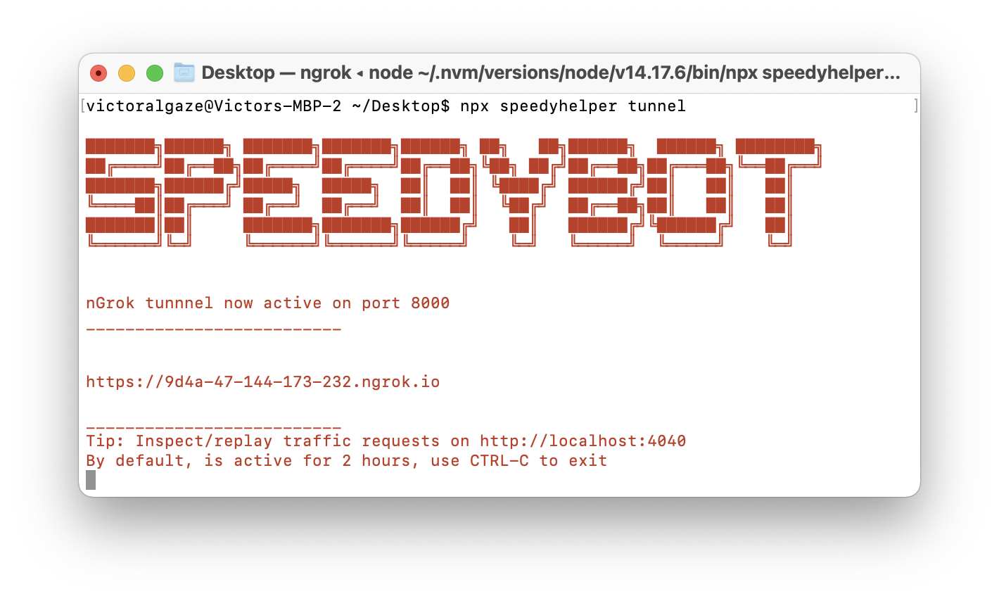

Note: If you leave ```webhookUrl``` blank in config.json and only need incoming WebEx webhooks, you don't need to tunnel at all

### nGrok

nGrok will tunnel a port on your machine to a fixed URL controlled by nGrok's system. This is done as a convenience step to make prototyping & implementing conversational experiences as fast (and secure) as possible.

nGrok offers pro/enterprise versions available here (fixed URLs, 2+hour duration, etc): https://ngrok.com/pricing 


<p>

**IMPORTANT:** nGrok will expose your port to nGrok's systems so your local install can talk to DialogFlow-- there are password-protected & pro/paid plans: https://ngrok.com/pricing

<details><summary>nGrok Background + History </summary>

nGrok was developed by Alan Shreeve **[as a way to learn Go](https://www.twilio.com/blog/2016/02/how-alan-shreve-built-ngrok-with-go.html)**. nGrok will open a "secure" tunnel to nGrok's system so external services (like webhook systems) can access exposed resources on your local machine as if they were deployed on the public internet. This can make developing bot handling webhooks insanely convenient & fast-- nGrok also comes with a network inspector available on localhost:4040

While it's really simple/fast to get up and running with a webhook, the downside of this approach is that every time you restart nGrok you will be assigned a new URL which you'll need to update the ```webhookUrl``` field inside **[config.json](./../settings/config.json)** (paid versions of nGrok have persistent URLs & other features.)

Additionally, this repo uses an **[npm package](https://www.npmjs.com/package/ngrok)** (not controlled by nGrok) which instruments on top of nGrok

Using nGrok means you...

- Trust nGrok & the team building systems/servicing for it

- Trust author of nGrok npm package (you can inspect package-lock.json) which downloads an nGrok binary

nGrok is used for speed + convenience only, instead, you can deploy to a publically-reachable server and use the host address as a tunnel

There are other alternative services like **[https://localtunnel.github.io/www/](localtunnel)**

Long story short, if nGrok/tunneling is scary or a Bad Idea for yourself and organization, just deploy the server and use the hostname as the ```webhookUrl``` value in **[config.json](./../settings/config.json)**
</p>
</details>

## Using a tunnel


### 1) Launch tunnel

Note the URL

```sh
npx tunnel 8000
```




### 2) Add your webhook to config.json

If you need a starter repo

```sh
npx speedyhelper setup
```

or equivalently:

```sh
git clone https://github.com/valgaze/speedybot-starter
cd speedybot-starter
npm run setup
``` 


```ts
// npm i speedybot, express, body-parser
import { SpeedybotWebhook } from 'speedybot'
import { BotHandler, SpeedybotConfig } from 'speedybot'
import express from 'express'
import bodyParser from 'body-parser'

const app = express()
const port = process.env.PORT || 8000
app.use(bodyParser.json());
app.post('/ping', (req, res) => res.send('pong!'))

// handler list
const handlers: BotHandler[] = [
    {
        keyword: ['hello', 'hey', 'yo', 'watsup', 'hola'],
        handler(bot, trigger) {
            const reply = `Heya how's it going ${trigger.person.displayName}?`
            bot.say(reply)
        },
        helpText: `A handler that greets the user`
    }
]

// webhook, note tunnel appended with webhook path
const config: SpeedybotConfig = {
    token: `__REPLACE__ME__`,
    webhookUrl: `https://123-45-678-910-987.ngrok.io/speedybotwebhook`
}

// webhook route matches webhookUrl path
app.post('/speedybotwebhook', SpeedybotWebhook(config, handlers))

app.listen(port, () => {
    console.log(`Listening + tunneled on port ${port}`)
})

```